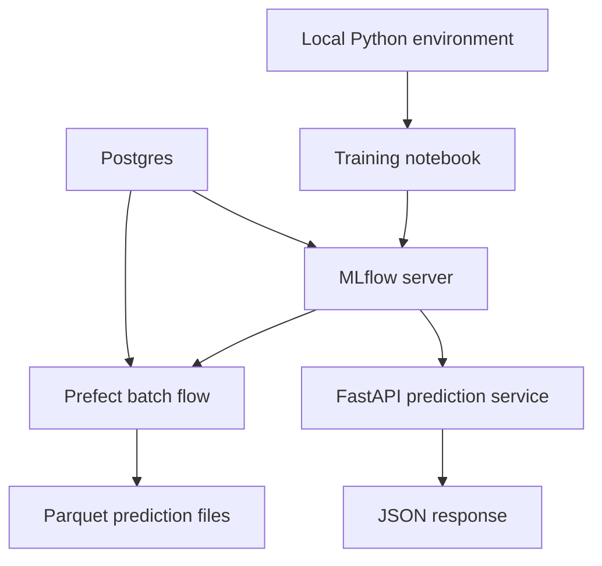

# Setup the Local MLOps Stack

This guide sets up the local infrastructure used by the rest of the repository. The goal is to run a model lifecycle on your machine without relying on external cloud services.

## What you will start

- `Postgres` for MLflow and Prefect metadata.
- `MLflow` for experiment tracking and model registration.
- `Prefect` for batch orchestration.
- `FastAPI` for online predictions.

## Architecture



## Before you start

Complete the **Setup** section in the [README](README.md) first. It covers creating the Python environment with `uv sync` and copying `.env.example` to `.env`.

You also need **Docker Desktop** installed and running, and enough free disk space to pull the images used by the local stack.

## Check the environment before running Docker

Run this command from the project root:

```bash
uv run python --version
uv run python -c "import fastapi, mlflow, prefect; print('Core imports look good.')"
```

You should see the active Python version and a short success message confirming that `FastAPI`, `MLflow` and `Prefect` all import correctly.

## Start the local services

```bash
mkdir -p storage/mlartifacts data/predictions
docker compose -f infra/compose.yaml up -d
```

The first boot can take a minute because the `mlflow` container installs its runtime dependencies inside the container before starting the service process.

When the stack is running, you should have:

- Postgres at <localhost:5432>
- MLflow at <http://127.0.0.1:5001>
- Prefect at <http://127.0.0.1:4200>

If `docker compose -f infra/compose.yaml up -d` fails immediately, check that Docker Desktop is running before trying again.

If the services start slowly, you can watch the boot process with:

```bash
docker compose -f infra/compose.yaml logs -f postgres mlflow prefect
```

## Confirm the services are reachable

Use these checks before moving on to the notebooks:

```bash
curl http://127.0.0.1:5001
curl http://127.0.0.1:4200/api/health
```

You should also be able to see the running containers with:

```bash
docker compose -f infra/compose.yaml ps
```

## Sanity Check — Run the training and batch steps

Run these commands from the project root:

```bash
uv run python -m src.training.train
uv run python -m src.batch.flow
```

These two commands run the pipeline end to end, so they check what the `curl` and import checks above cannot: that a run and a model version reach Postgres, that the artifact store accepts the model, and that Prefect executes a flow.

The **training** command registers `green-taxi-duration` version 1. Open the MLflow UI at <http://127.0.0.1:5001> to see the run and the registered model. Notebook 02 covers the same steps in detail and registers version 2, so two versions there are expected.

The **batch** command scores the input file and writes a Parquet file under `data/predictions/`.

If both commands complete, the environment is ready for the notebooks.

## What each service does

- `Postgres` stores MLflow and Prefect metadata.
- `MLflow` tracks training runs and stores registered model versions.
- `Prefect` orchestrates the batch workflow and provides a UI for runs and deployments.
- `FastAPI` is not started during setup, but the later lesson uses the same registered model for online inference.

## Why this setup matters

This stack keeps the focus on model lifecycle concepts:

- training and tracking,
- registered models,
- repeatable batch scoring,
- lightweight online inference.

The next notebook uses the running MLflow server to train and register the first model version.
