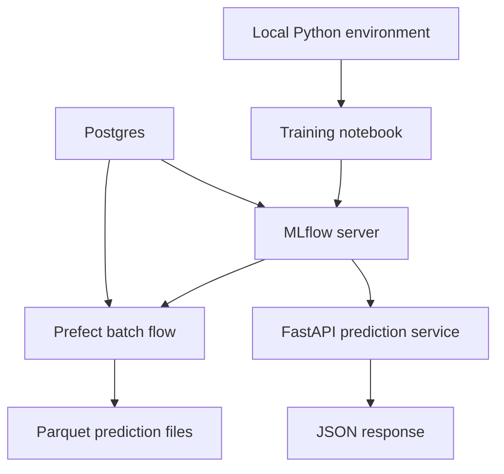

# Setup the Local MLOps Stack

This guide sets up the local infrastructure used by the rest of the repository. The goal is to run a model lifecycle on your machine without relying on external cloud services.

## What you will start

- `Postgres` for MLflow and Prefect metadata
- `MLflow` for experiment tracking and model registration
- `Prefect` for batch orchestration
- `FastAPI` for online predictions

## Architecture



## Prerequisites

- Python `3.11.3`
- Docker Desktop or another Docker-compatible runtime
- Enough disk space to pull the Docker images used by the local stack

## Create the Python environment

### `macOS` / `Linux`

```bash
pyenv local 3.11.3
python -m venv .venv
source .venv/bin/activate
python -m pip install --upgrade pip
python -m pip install -r requirements.txt
```

### `Windows`

For `Git Bash` CLI:

```bash
pyenv local 3.11.3
python -m venv .venv
source .venv/Scripts/activate
python -m pip install --upgrade pip
python -m pip install -r requirements.txt
```

For `PowerShell` CLI:

```powershell
pyenv local 3.11.3
python -m venv .venv
.venv\Scripts\Activate.ps1
python -m pip install --upgrade pip
python -m pip install -r requirements.txt
```

Then copy the default local environment file:

**`macOS`** / **`Linux`** / **`Git Bash`**

```bash
cp .env.example .env
```

**`PowerShell`**

```powershell
Copy-Item .env.example .env
```

After copying `.env.example` to `.env`, keep the default local URLs unless you intentionally change the local stack ports.

The most important environment variables are:

- `MLFLOW_TRACKING_URI`: MLflow server URL used by training, batch, and API code
- `PREFECT_API_URL`: local Prefect API URL
- `MLFLOW_MODEL_NAME`: registered model name that batch and online inference will resolve by default
- `BATCH_INPUT_URI`: Parquet file scored in the batch chapter

## Check the environment before running Docker

Run this command from the project root:

```bash
python --version
python -c "import fastapi, mlflow, prefect; print('Core imports look good.')"
```

You should see the active Python version and a short success message confirming that `FastAPI`, `MLflow` and `Prefect` all import correctly.

## Start the local services

**`macOS`** / **`Linux`** / **`Git Bash`**

```bash
mkdir -p storage/mlartifacts data/predictions
docker compose -f infra/compose.yaml up -d
```

**`PowerShell`**

```powershell
New-Item -ItemType Directory -Path storage/mlartifacts, data/predictions -Force
docker compose -f infra/compose.yaml up -d
```

The first boot can take a minute because the `mlflow` and `prefect` containers install their runtime dependencies inside the container before starting the service process.

When the stack is running, you should have:

- MLflow at `http://127.0.0.1:5001`
- Prefect at `http://127.0.0.1:4200`
- Postgres at `localhost:5432`

If `docker compose -f infra/compose.yaml up -d` fails immediately, check that Docker Desktop is running before trying again.

If the services start slowly, you can watch the boot process with:

```bash
docker compose -f infra/compose.yaml logs -f postgres mlflow prefect
```

## Confirm the services are reachable

Use these checks before moving on to the notebooks:

```bash
curl http://127.0.0.1:5001
curl http://127.0.0.1:4200/api/health
```

You should also be able to see the running containers with:

```bash
docker compose -f infra/compose.yaml ps
```

## Run the training and batch steps (sanity check)

Run these commands from the project root:

```bash
python -m src.training.train
python -m src.batch.flow
```

If both commands complete, the environment is ready for the notebooks. The batch command should create a Parquet file under `data/predictions/`.

## What each service does

- `Postgres` stores MLflow and Prefect metadata.
- `MLflow` tracks training runs and stores registered model versions.
- `Prefect` orchestrates the batch workflow and provides a UI for runs and deployments.
- `FastAPI` is not started during setup, but the later lesson uses the same registered model for online inference.

## Why this setup matters

This stack keeps the focus on model lifecycle concepts:

- training and tracking,
- registered models,
- repeatable batch scoring,
- lightweight online inference.

The next notebook uses the running MLflow server to train and register the first model version.

## Cleanup

When you are done for the day, stop the local services but keep the database volume and generated files:

```bash
docker compose -f infra/compose.yaml down
```

To fully reset the local state before rerunning the lessons from scratch:

**`macOS`** / **`Linux`** / **`Git Bash`**

```bash
docker compose -f infra/compose.yaml down -v
rm -rf data/predictions storage/mlartifacts .env
mkdir -p data
touch data/.gitkeep
```

**`PowerShell`**

```powershell
docker compose -f infra/compose.yaml down -v
Remove-Item data/predictions, storage/mlartifacts, .env -Recurse -Force -ErrorAction SilentlyContinue
New-Item -ItemType Directory -Path data -Force
New-Item -ItemType File -Path data/.gitkeep -Force
```

This removes local MLflow artifacts, registered model metadata, Prefect run history, batch output files, and your copied `.env`.
