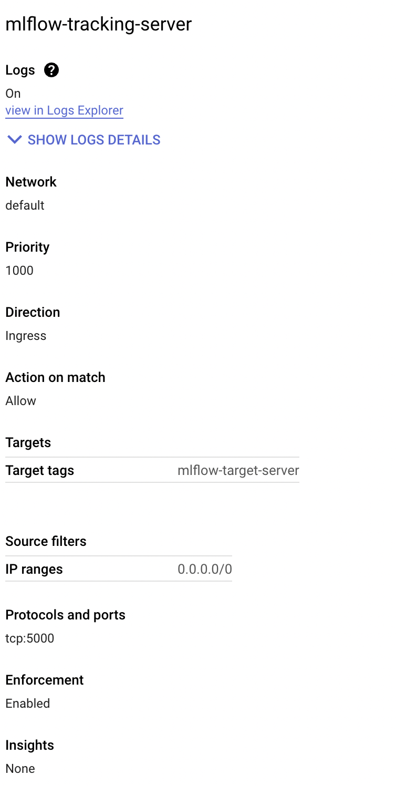
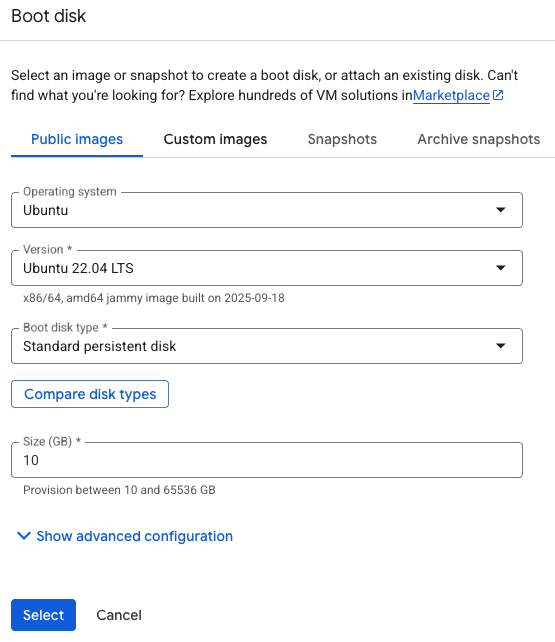
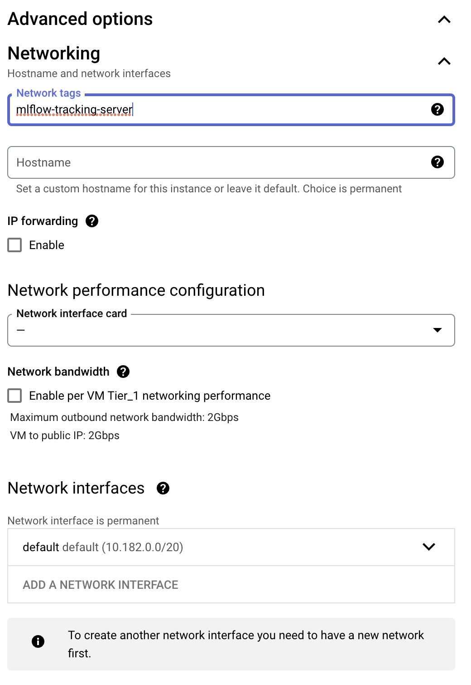
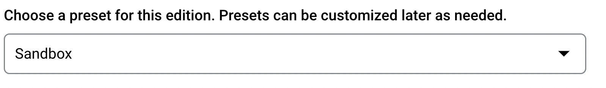
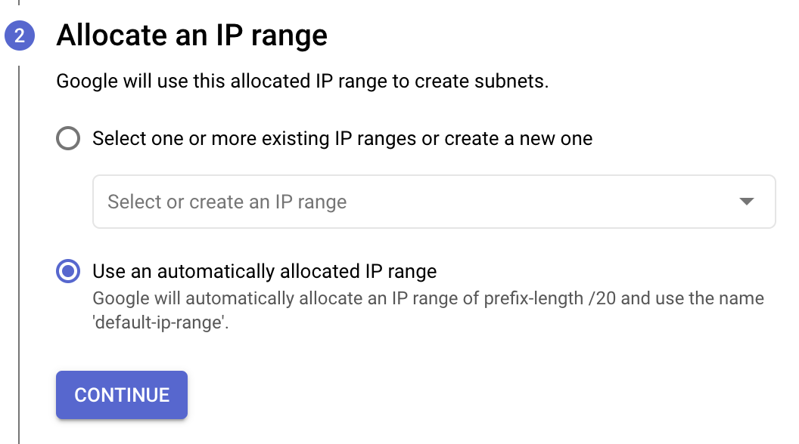
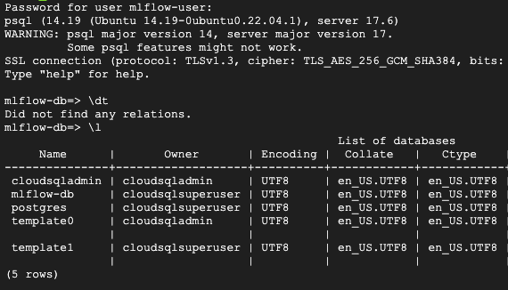

# Setup a MLFlow server in GCP

MLFlow is an open source platform for managing the end-to-end machine learning lifecycle. It has four components:

- Tracking experiments to record and compare parameters and results ([MLflow Tracking](https://www.mlflow.org/docs/latest/tracking.html#tracking)).
- Packaging ML code in a reusable, reproducible form in order to share with other data scientists or transfer to production ([MLflow Projects](https://www.mlflow.org/docs/latest/projects.html#projects)).
- Managing and deploying models from a variety of ML libraries to a variety of model serving and inference platforms ([MLflow Models](https://www.mlflow.org/docs/latest/models.html#models)).
- Providing a central model store to collaboratively manage the full lifecycle of an MLflow Model, including model versioning, stage transitions, and annotations ([MLflow Model Registry](https://www.mlflow.org/docs/latest/model-registry.html#registry)).

## Create a GCP project

If you already have a GCP project, you can skip this step. Otherwise, create a new project in GCP. You can follow the instructions [here](https://cloud.google.com/resource-manager/docs/creating-managing-projects).

## Create a Firewall rule

In order to access the MLFlow server from your local machine, you need to create a firewall rule to allow traffic from your IP address. You can follow the instructions [here](https://cloud.google.com/vpc/docs/using-firewalls) to create a firewall rule.

1. In GCP go to VPC network
2. Go to Firewall rules
3. Click on Create Firewall Rule
4. Give it a name: `mlflow-tracking-server`
5. Set logging to `On`
6. Network: `default`
7. Priority: `1000`
8. Direction of traffic: `Ingress`
9. Action on match: `Allow`
10. Target-Tag: `mlflow-tracking-server`
11. Source IP ranges: `0.0.0.0/0`
12. Set Protocols and Ports
    + Under Protocols and ports, select Specified protocols and ports.
    + Check tcp, and in the port field enter 5000.
13. Click on Create

*_Note:_* If you get redirected to a page to enable `Compute Engine API ` click `Enable` Alternatively this is also found under [link](https://console.cloud.google.com/marketplace/product/google/compute.googleapis.com)



## Create a Compute Engine instance

In order to run the MLFlow server, you need to create a Compute Engine instance. You can follow the instructions [here](https://cloud.google.com/compute/docs/instances/create-start-instance) to create a Compute Engine instance.

1. In GCP go to Compute Engine
2. Click on Create Instance
3. Machine configuration: Name:`mlflow-tracking-server` (has to be unique)
4. Region: `europe-west3 (Frankfurt)`
5. Zone: `europe-west3-c`
6. Machine type: `e2-medium (2 vCPUs, 4 GB memory)`
7. Under OS and Storage (side panel on the left):

   - OS image: `Ubuntu 22.04 LTS (x86/64)`
   - Size (GB): `10 GB`
   - Boot disk type: `Standard persistent disk`
     
8. Under Networking (side panel on the left): Network tags: `mlflow-tracking-server`
9. Under Security (side panel on the left): `Allow full access to all Cloud APIs` (normally you would set it more fine-grained, but for this tutorial we will allow full access)
10. Click on Create



## Create a PostgreSQL instance

In order to store the MLFlow experiments, you need to create a PostgreSQL instance. You can follow the instructions [here](https://cloud.google.com/sql/docs/postgres/create-instance) to create a PostgreSQL instance.

1. In GCP go to Cloud SQL
2. Click on Create Instance
3. Choose PostgreSQL
4. Give it a name: `mlflow-metadata-store`
5. Enter a password
6. configuration: `sandbox`
   
7. Region: `europe-west3 (Frankfurt)`
8. Zone: `Single zone`
9. Customize your instance:
   - Storage
     - Storage type: `SSD`
     - Storage capacity: `10 GB`
   - Connections
     - Public IP: `On`
     - Private IP: `On` with Network: `default`
       (if you are asked to set up a connection, click on `Set up connection` and follow the instructions, choose `Use an automatically allocated IP range`)
       
10. Click on Create Instance (this might take a few minutes)
11. Once the instance is created, we need to create a database. Click on the instance name and go to Databases
12. Click on Create database
13. Give it a name: `mlflow-db`
14. Click on Create
15. Create a user: Click on Users (side panel on the left) and click on Add user account
16. Give it a name: `mlflow-user`
17. Enter a password

## ssh into the Compute Engine instance

In order to install the MLFlow server, you need to ssh into the Compute Engine instance. You can follow the instructions [here](https://cloud.google.com/compute/docs/instances/connecting-to-instance) to ssh into the Compute Engine instance.

1. In GCP go to Compute Engine
2. Click on the SSH button next to the `mlflow-tracking-server` instance
3. Once you are in the instance, run the following commands to install the MLFlow server:

First we will check if the VM has access to the database. Run the following command:

```bash
sudo apt-get update
sudo apt-get install postgresql-client
```

And than:

```bash
psql -h CLOUD_SQL_PRIVATE_IP_ADDRESS -U USERNAME DATABASENAME
```

After entering your password you will see a screen as shown below and when you type in `\l` you should see `mlflow-db` which was the empty database created before then press q.
Type in `exit` to come out of the psql shell.



## Install the MLFlow server

First we will install pyenv:

```bash
sudo apt-get update
sudo apt-get install git python3-pip make build-essential libssl-dev zlib1g-dev libbz2-dev libreadline-dev libsqlite3-dev wget curl llvm libncurses5-dev libncursesw5-dev xz-utils tk-dev libffi-dev liblzma-dev
```

Than we will install pyenv:

```bash
curl https://pyenv.run | bash
```

Now we will add pyenv to our path:

```bash
echo 'export PATH="$HOME/.pyenv/bin:$PATH"' >> ~/.bashrc
echo 'eval "$(pyenv init -)"' >> ~/.bashrc
echo 'eval "$(pyenv virtualenv-init -)"' >> ~/.bashrc

exec $SHELL
```

Now we will install Python 3.11.3. The first line of the code below might take 10-20 minutes:

```bash
pyenv install 3.11.3
pyenv global 3.11.3
python -m venv mlflow
source mlflow/bin/activate
pip install --upgrade pip
pip install mlflow boto3 google-cloud-storage psycopg2-binary
```

Before we start the server we need to create also a GCS bucket to store the MLFlow artifacts. Follow the instructions in the [next section](#create-a-gcs-bucket) to create a GCS bucket.

And finally we will start the MLFlow server:

```bash
mlflow server \
 -h 0.0.0.0 \
 -p 5000 \
 --backend-store-uri postgresql://<db-user>:<db-password@<db-internal-ip>:5432/<db-name> \
 --default-artifact-root gs://<gcs bucket>/<folder>
```

+ `--backend-store-uri` is the connection string to the PostgreSQL database. It has the following format: `postgresql://<db-user>:<db-password@<db-internal-ip>:5432/<db-name>`
+ `--default-artifact-root` is the GCS bucket where the MLFlow artifacts will be stored. It has the following format: `gs://<gcs bucket>/<folder>`

Now if you go to `http://<compute engine external ip>:5000` you should see the MLFlow UI.

In case you want to run the MLFlow server in the backgroung you can use `nohup` like this:

```bash
nohup mlflow server \
 -h 0.0.0.0 \
 -p 5000 \
 --backend-store-uri postgresql://<db-user>:<db-password@<db-internal-ip>:5432/<db-name> \
 --default-artifact-root gs://<gcs bucket>/<folder> &
```

The `nohup` command will run the MLFlow server in the background and the `&` at the end will allow you to continue using the terminal. The output will be written to a file called `nohup.out`.

To stop the MLFlow server you can use the following command to find the process id and kill it:

```bash
ps ef | grep mlflow
kill <process id> 
```

In the above command replace `<process id>` with the actual process id of the MLFlow uvicorn server.

## Create a GCS bucket

In order to store the MLFlow artifacts, you need to create a GCS bucket. You can follow the instructions [here](https://cloud.google.com/storage/docs/creating-buckets) to create a GCS bucket.

1. In GCP go to Buckets
2. Click on Create
3. Give it a name: `mlflow-artifacts` (has to be unique)
4. Location type: `Region`
5. Location: `europe-west3 (Frankfurt)`
6. Click on Create

Once the bucket is created you can create a folder inside the bucket to store the MLFlow artifacts.
Now you can use the bucket name and the folder name in the `--default-artifact-root` parameter when starting the MLFlow server.

## Cloud Credentials

In order to access the GCS bucket from your compiuter, you need to create a service account and download the credentials. You can follow the instructions [here](https://cloud.google.com/iam/docs/creating-managing-service-accounts) to create a service account and download the credentials.

1. In GCP go to IAM & Admin (side panel on the left) then go to Service Accounts
2. Click on Service accounts
3. Click on the `Compute Engine default service account` under the Name column
4. Under Actions click on the three dots and click on Manage keys
5. Click on Add key
6. Click on Create new key
7. Choose JSON in the pop up window and click on Create
8. Save the credentials file to your local machine (if you add it to your git repo, make sure to add it to your `.gitignore` file)
