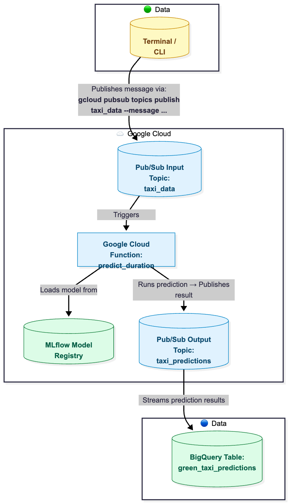
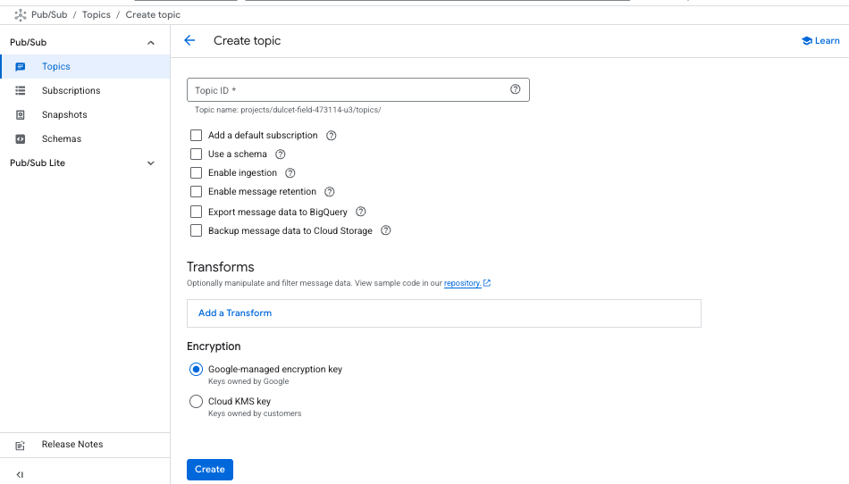
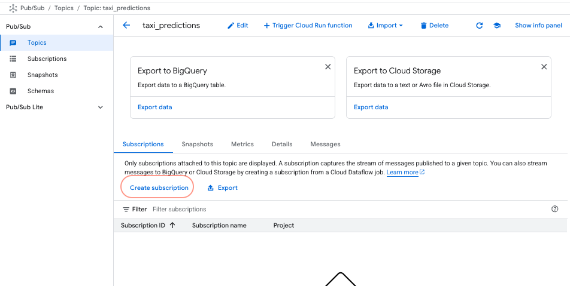
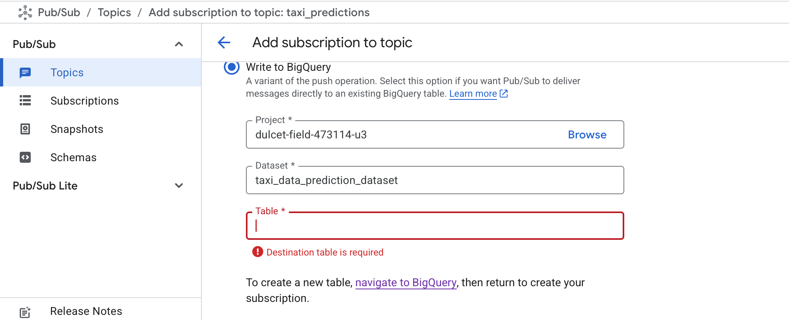
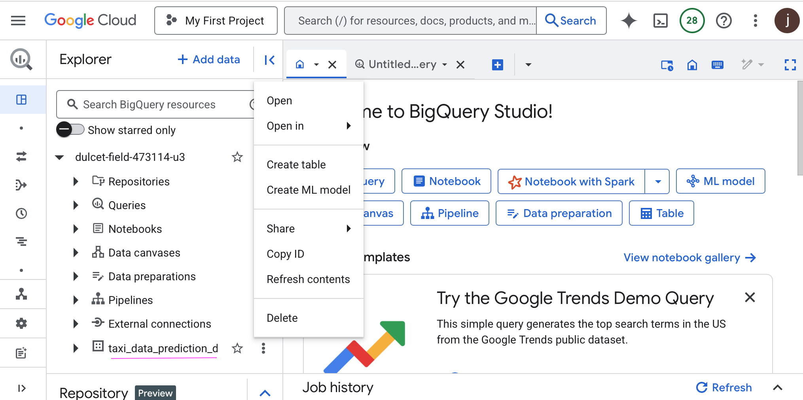
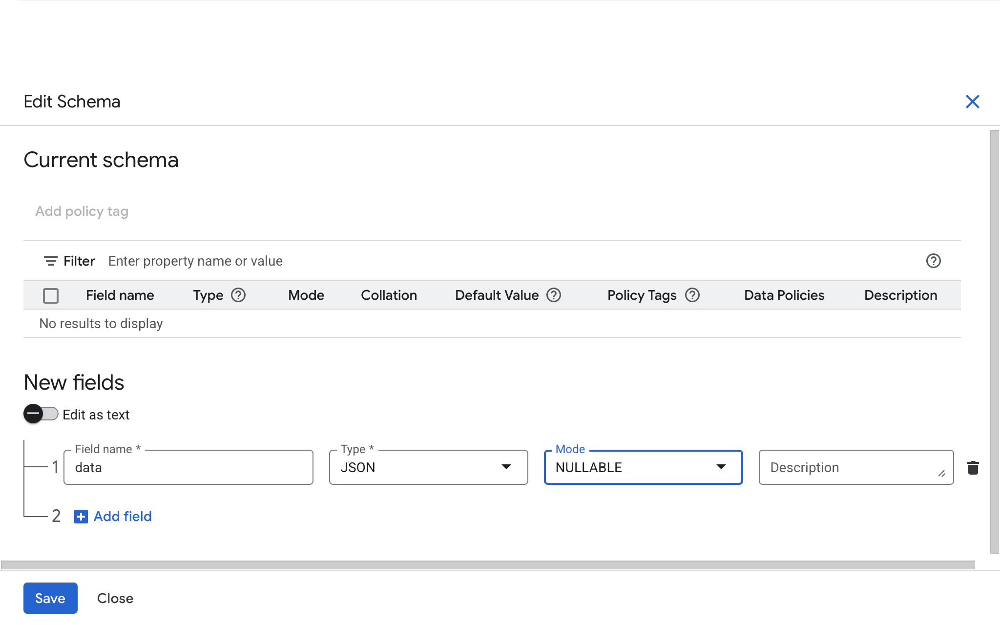
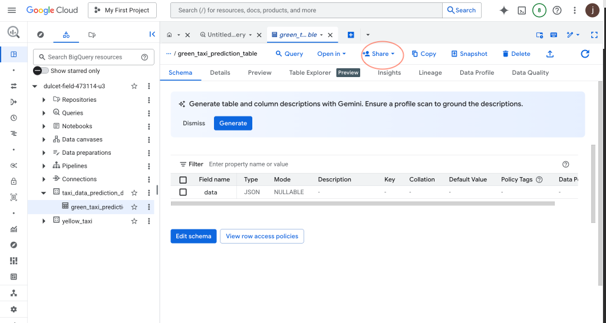
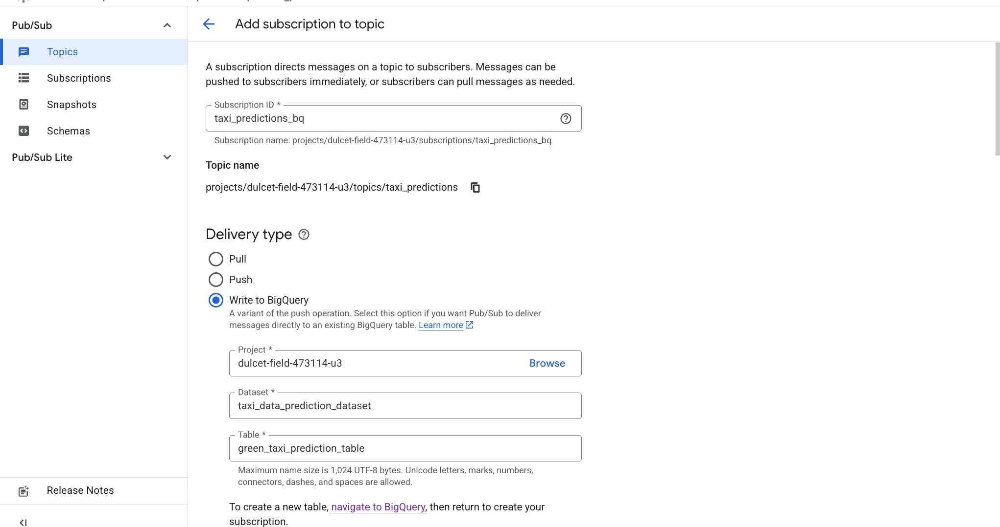
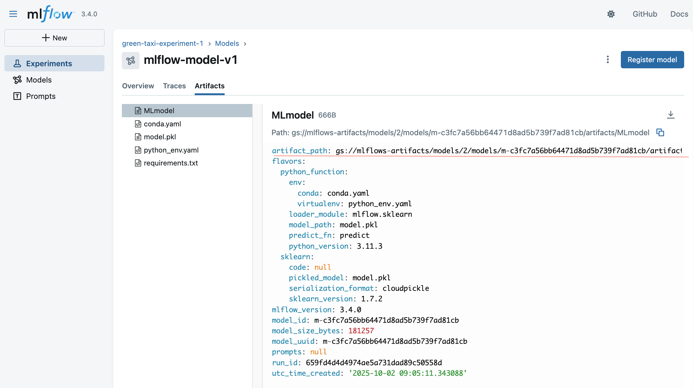

# **Stream Predictions with Google Cloud Functions**
We will deploy a **real-time stream prediction service** using **MLflow** and **Google Cloud Functions**.  
The service is triggered by **messages** published to a **`input Pub/Sub topic`** (taxi_data), performs model inference using **`MLflow`**, and publishes the predictions results to an **`output Pub/Sub topic`** (taxi_predictions) for downstream processing in **BigQuery** (a fully managed data warehouse for analytics).

Below is shown the overall architecture of the **real-time streaming prediction system**.




## ☁️ **Pub/Sub Architecture Components**

**Google Cloud Pub/Sub** is a **fully managed, real-time messaging service** that allows you to **send and receive messages** between independent applications.  You can learn more about Pub/Sub in the [official documentation](https://cloud.google.com/pubsub/docs/overview).

It consists of three main components — **Publisher**, **Topic**, and **Subscriber**.

---

### 🟢 **Publisher**

A **publisher** is any **application or service that creates and sends messages** to a **Pub/Sub topic**.  
It acts as the **data producer** in the system — the component that originates events or information for others to consume.

**Publishers**:
- Create structured messages (usually in JSON or binary format).  
- Send these messages to a **topic**, which acts as a **shared message channel**.  
- Don’t need to know who will receive or process the messages.  
- Can operate independently and in parallel — many publishers can send data to the same topic at once.


---

#### 💡 **Our Pipeline**
In our architecture, the **publisher** is the component responsible for sending taxi trip data to the **input topic (`taxi_data`)**.

| Environment | Publisher | Description |
|--------------|------------|--------------|
| **Development / Testing** | 🧑‍💻 **Terminal (CLI)** | We manually publish messages using the `gcloud` command. |
| **Production** | ⚙️ **Application Service / Data Pipeline** | Publishes real-time trip events automatically to Pub/Sub. |

##### Example (manual message publishing):

```bash
gcloud pubsub topics publish taxi_data \
  --message '{"ride_id": "123", "PULocationID": 1, "DOLocationID": 2, "trip_distance": 3}'
```
Each message represents a **taxi trip event**, containing the features required by the model to make a prediction:
+ **ride_id** — unique identifier for the trip
+ **PULocationID** — pickup location ID
+ **DOLocationID** — drop-off location ID
+ **trip_distance** — trip distance 
  
In production, this publishing could come from:
+ A **backend service** that emits prediction requests
+ An **ETL pipeline** sending live trip data
+ A **data ingestion system** capturing events from APIs 

---
### ☁️ **Topics**
A **topic** is a **named communication channel** that connects **publishers** and **subscribers**.  Publishers send messages to the topic, and subscribers receive those messages **asynchronously** through **subscriptions**. A topic makes systems more **flexible and scalable** since publishers and subscribers don’t have to interact directly or depend on each other’s availability.
<div role="note" aria-label="Analogy"
     style="border:1px solid #e5e7eb;border-left:6px solid #3b82f6;border-radius:8px;
            padding:12px 14px;background:#f8fafc;font-family:system-ui, Segoe UI, Roboto, Helvetica, Arial, sans-serif;">
  <div style="display:flex;align-items:flex-start;gap:10px;">
    <div style="font-size:20px;line-height:1;">💬</div>
    <div>
      <strong style="font-weight:700;">Analogy:</strong>
      <p style="margin:6px 0 0 0;line-height:1.5;">
        Think of a topic as a <strong>mailbox</strong> — publishers drop messages in,
        and subscribers pick them up when ready.
      </p>
    </div>
  </div>
</div>

#### 💡 **Our Pipeline**
We use **two Pub/Sub topics**,  each with a specific role:
| Topic | Role|Description                                                                                                             |
| ---------------------- | --------------- | ----------------------------------------------------------------------------------------------------------------------- |
| **`taxi_data`**        | 🟢 Input Topic  | Receives raw trip data from the publisher and **triggers the Cloud Function (`predict_duration`)** for model inference. |
| **`taxi_predictions`** | 🔵 Output Topic | Receives prediction results from the **Cloud Function** and streams them into **BigQuery** for analytics and dashboards.    |

This two-topic design keeps the system **modular**, because it separets **input data ingestion** from **output prediction streaming**.

---
#### 📨 **Event Payload Example**

When a message is published to the **input topic (`taxi_data`)**, Pub/Sub wraps it in a **CloudEvent** and delivers it to the subscribed **Cloud Function (`predict_duration`)**.

Below is an example of the event payload received by the **Cloud Function**:

```json
{
  "attributes": {
    "specversion": "1.0",
    "id": "8413039268015605",
    "source": "//pubsub.googleapis.com/projects/positive-sector-383614/topics/taxi_data",
    "type": "google.cloud.pubsub.topic.v1.messagePublished",
    "datacontenttype": "application/json",
    "time": "2023-06-17T15:18:06.509Z"
  },
  "data": {
    "message": {
      "data": "eyJyaWRlX2lkIjogIjEyMyIsICJQVUxvY2F0aW9uSUQiOiAxLCAiRE9Mb2NhdGlvbklEIjogMiwgInRyaXBfZGlzdGFuY2UiOiAzfQ==",
      "messageId": "8413039268015605",
      "publishTime": "2023-06-17T15:18:06.509Z"
    },
    "subscription": "projects/positive-sector-383614/subscriptions/eventarc-europe-west3-pred-ride-duration-795483-sub-307"
  }
}
```
The `field data.message.data` contains the **Base64-encoded message payload** originally published by the **publisher**.

After decoding, the payload becomes:

```json
{
  "ride_id": "123",
  "PULocationID": 1,
  "DOLocationID": 2,
  "trip_distance": 3
}
```
This decoded JSON object represents the **input features** required for the ML model to make a prediction.


<div role="note" aria-label="Important Note"
     style="border:1px solid #e5e7eb;border-left:6px solid #10b981;border-radius:8px;
            padding:12px 14px;background:#f8fafc;font-family:system-ui,Segoe UI,Roboto,Helvetica,Arial,sans-serif;">
  <div style="display:flex;align-items:flex-start;gap:10px;">
    <div style="font-size:20px;line-height:1;">🧠</div>
    <div>
      <strong style="font-weight:700;">Note:</strong>
      <p style="margin:6px 0 0 0;line-height:1.5;">
        All Pub/Sub messages received by Cloud Functions are <strong>Base64-encoded</strong>.<br/>
        Your function must <strong>decode the message</strong> before processing its content.
      </p>
    </div>
  </div>
</div>

---

### 🔵 **Subscriber**

A **subscriber** is any **application or service that receives and processes messages** from a **Pub/Sub topic**. It acts as the **consumer** in the Pub/Sub architecture — listening for new messages, processing them, and acknowledging successful delivery.

Subscribers:
- **Pull or receive messages** from a topic via a **subscription**.  
- **Acknowledge (ACK)** each message after successful processing.  
- Can be **independent and parallel**, allowing multiple subscribers to consume data concurrently.  
- May handle failures using features like **dead-letter queues (DLQs)** or **retry policies**.

<div role="note" aria-label="Dead-letter Queues and Retry Policies"
     style="border:1px solid #e5e7eb;border-left:6px solid #f59e0b;border-radius:8px;
            padding:12px 14px;background:#fffbeb;font-family:system-ui,-apple-system,Segoe UI,Roboto,Helvetica,Arial,sans-serif;">
  <div style="display:flex;align-items:flex-start;gap:10px;">
    <div style="font-size:20px;line-height:1;">⚙️</div>
    <div>
      <strong style="font-weight:700;">Note on Dead-Letter Queues (DLQs) and Retry Policies:</strong>
      <p style="margin:6px 0 0 0;line-height:1.6;">
        A <strong>Dead-Letter Queue (DLQ)</strong> is a special Pub/Sub topic that stores messages
        that <strong>could not be processed successfully</strong> after a defined number of delivery attempts.
        DLQs help preserve failed messages for later inspection, debugging, or manual reprocessing.<br/><br/>
        A <strong>Retry Policy</strong> defines how Pub/Sub <strong>re-delivers unacknowledged messages</strong>
        to subscribers. You can configure parameters such as the minimum and maximum backoff times between retries.
        Together, DLQs and retry policies ensure <strong>reliable, fault-tolerant message processing</strong>
        without losing data.
      </p>
    </div>
  </div>
</div>


---

#### 💡 **Our Pipeline**

We have **two subscribers**, each playing a different role in the end-to-end pipeline:

| Subscriber | Source Topic | Purpose |
|-------------|---------------|----------|
| **Google Cloud Function (`predict_duration`)** | **`taxi_data`** | Triggered automatically when new trip data is published. It loads the ML model from **MLflow**, performs inference, and publishes results to the `taxi_predictions` topic. |
| **BigQuery Table (`green_taxi_predictions`)** | **`taxi_predictions`** | Subscribed to the output topic to automatically receive and store prediction results for analysis. |

---

#### ⚙️ **Subscriber Workflow**

1. **Pub/Sub delivers a message** to the Cloud Function.  
2. The function **extracts and decodes** the message payload.  
3. It **loads the ML model** from the MLflow registry.  
4. The function **runs the prediction** and **publishes the result** to the output topic.  
5. **BigQuery**, as a subscriber to that output topic, **automatically stores the prediction** in a table for analytics or dashboards.


<div role="note" aria-label="Summary"
     style="border:1px solid #e5e7eb;border-left:6px solid #0ea5e9;border-radius:8px;
            padding:12px 14px;background:#f8fafc;font-family:system-ui,-apple-system,Segoe UI,Roboto,Helvetica,Arial,sans-serif;">
  <div style="display:flex;align-items:flex-start;gap:10px;">
    <div style="font-size:20px;line-height:1;">🧠</div>
    <div>
      <strong style="font-weight:700;">Summary:</strong>
      <p style="margin:6px 0 0 0;line-height:1.5;">
        Subscribers are the consumers in the Pub/Sub system.<br/>
        In our pipeline, the Cloud Function (<code>predict_duration</code>) subscribes to the input topic (<code>taxi_data</code>),
        while BigQuery subscribes to the output topic (<code>taxi_predictions</code>) to persist prediction results.
      </p>
    </div>
  </div>
</div>


## **Google Cloud Functions**

**Google Cloud Functions** is a **serverless compute platform** that allows us to **run code in response to events** without managing servers or infrastructure. This kind of product is also known as **Functions as a Service (FaaS)**.

Because it’s serverless:
- We **don’t need to manage servers or runtime environments**  
- It’s **cost-efficient**, running **only when triggered** by an event  
- It **automatically scales** up or down based on the number of incoming events 

In our pipeline, we’ll **deploy our ML model as a Cloud Function**, which will:
1. Be **triggered by Pub/Sub events**
2. **Load the model** (from MLflow Model Registry)
3. **Generate predictions** in real time
4. **Publish results** to a Pub/Sub topic


## **Step-by-Step Deployment Guide**

### **Setup Pub/Sub**

We will use `Pub/Sub` to trigger the `Google Cloud Function` and to receive the prediction. We will use the `gcloud` command line tool to create a `Pub/Sub` topic that triggers the function.

> make sure that you set your project as the default project

```bash
gcloud config set project <your-project-id>
```

**Topic**

```bash
gcloud pubsub topics create taxi_data
```

A second topic will be created to receive the predictions from the function but we will do that in the GCP Console because we can easily add BigQuery as Destination.

1. Go to the [GCP Console](https://console.cloud.google.com/)
2. Go to `Pub/Sub` and select `Topics`
3. Click on `Create Topic`
4. Name the Topic ID `taxi_predictions` 
5. Uncheck `Add default subscription` and then click `Create` 
6. Click on the created topic `taxi_predictions` and then on `Create subscription` 
6. Name the Subscription ID `taxi_predictions_bq`
7. Choose `Write to BigQuery`
8.  Click in the `Dataset`field and then  create a dataset`
   + name the Dataset ID `taxi_data_predictions_dataset`
   + Under Location type choose `Region` and then select `europe-west3`
   + Click on `Create dataset`
9.  To create a new table click on `navigate to BigQuery` 
10. Once redirected to BigQuery  click on the 3 dots near to `taxi_data_prediction_dataset` and then on `Create table` 
11. Name the table `green_taxi_prediction_table` then click on `Create table`
12. Once you have created the table click on `green_taxi_prediction_table` then on  `Edit schema`, add a field name `data` with the type `JSON` then click on `Save` 
13. Click again on `green_taxi_prediction_table` then on `+ Share`. In the pop up window on `Manage permission`. 
14. In the new window under the role `BigQuery Data Editor` check that   `service-<your project number>@gcp-sa-pubsub.iam.gserviceaccount.com` is added. If not add it manually and give it the role of `BigQuery Data Editor`
15.  Back in the `Pub/Sub` topic add the table name. 
16.  At very bottom click on `Create`

---
### **Setup Google Cloud Function**

We have to first create a python file with the function that we want to deploy. Which needs to be named `main.py`. You will find the file in the `src/stream` folder. The function will be triggered by a `Pub/Sub` message and this time will not return the predictions into a file but into bigquery.

We will start with the imports:

```python
import json
import os
import base64
import mlflow
import functions_framework
from google.cloud import pubsub_v1
```

The message we get from `PubSub` is encoded and we have to decode ot with the `base64` library. We will also use the `json` library to parse the message.

An example of a PubSub message:

```json
{
    "attributes": {
        "specversion": "1.0",
        "id": "8413039268015605",
        "source": " //pubsub.googleapis.com/projects/positive-sector-383614/topics/taxi_data",
        "type": "google.cloud.pubsub.topic.v1.messagePublished",
        "datacontenttype": "application/json",
        "time": "2023-06-17T15:18:06.509Z"
    },
    "data": {
        "message": {
            "data": "eyJyaWRlX2lkIjogIjEyMyIsICJQVUxvY2F0aW9uSUQiOiAxLCAiRE9Mb2NhdGlvbklEIjogMiwgInRyaXBfZGlzdGFuY2UiOiAzfQ==",
            "messageId": "8413039268015605",
            "message_id": "8413039268015605",
            "publishTime": "2023-06-17T15:18:06.509Z",
            "publish_time": "2023-06-17T15:18:06.509Z"
        },
        "subscription": "projects/positive-sector-383614/subscriptions/eventarc-europe-west3-pred-ride-duration-795483-sub-307"
    }
}

```

And the code to decode the message:

```python
def transform_input(event):
    """Decode Pub/Sub message from CloudEvent and prepare model input."""
    print("📥 Received event:", event)

    try:
        pubsub_message = event.data["message"]
        encoded_data = pubsub_message["data"]
        decoded_data = base64.b64decode(encoded_data).decode("utf-8")
        data = json.loads(decoded_data)

        ride_id = data["ride_id"]
        pick_up_location = data["PULocationID"]
        dropoff_location = data["DOLocationID"]
        trip_distance = data["trip_distance"]

        message_id = pubsub_message["message_id"]
        publish_time = pubsub_message["publish_time"]

        metadata = {
            "ride_id": ride_id,
            "message_id": message_id,
            "publish_time": publish_time,
            "PULocationID": pick_up_location,
            "DOLocationID": dropoff_location,
            "trip_distance": trip_distance,
        }

        prediction_input = {
            "trip_route": f"{pick_up_location}_{dropoff_location}",
            "trip_distance": trip_distance,
        }

        print("✅ Prepared prediction input:", prediction_input)
        return prediction_input, metadata

    except Exception as e:
        raise ValueError(f"❌ Error parsing Pub/Sub message: {e}")

```

Now we have to load the model and make the prediction. We will use the `mlflow` library to load the model. This time we will load the model directly from the `MLFlow` registry with a link to the GC Storage bucket. You can find the link in the MLFlow UI.


```python
def load_model(gs_path_artifact):
    """Load MLflow model from GCS path."""
    print(f"📦 Loading model from: {gs_path_artifact}")
    loaded_model = mlflow.pyfunc.load_model(gs_path_artifact)
    return loaded_model


def apply_model(model, prediction_input):
    """Apply model to input data."""
    prediction = model.predict(prediction_input)
    return prediction
```

Last but not least we have to call all the functions and publish the prediction to the `Pub/Sub` topic that we created earlier. We will use the `google-cloud-pubsub` library to publish the message. We need to add extra environment variable to the .env file: GCP_PROJECT, RESULT_TOPIC and GC_PATH_MODEL_ARTIFACT.

```python
@functions_framework.cloud_event
def predict_duration(cloudevent):
    """Main entry point — triggered by Pub/Sub CloudEvent."""
    # --- Environment variables ---
    GC_PATH_MODEL_ARTIFACT = os.environ.get("GC_PATH_MODEL_ARTIFACT")
    PROJECT_ID = os.environ.get("GCP_PROJECT")
    topic_name = os.environ["RESULT_TOPIC"]

    print(f"🧭 Detected PROJECT_ID: {PROJECT_ID}")
    print(f"🧠 Model Artifact Path: {GC_PATH_MODEL_ARTIFACT}")
    print(f"📤 Output Topic: {topic_name}")

    publisher = pubsub_v1.PublisherClient()

    # --- Step 1: Parse input ---
    print("➡️ Loading data...")
    prediction_input, metadata = transform_input(cloudevent)

    # --- Step 2: Load model ---
    print("➡️ Loading model...")
    model = load_model(GC_PATH_MODEL_ARTIFACT)

    # --- Step 3: Make prediction ---
    print("➡️ Making prediction...")
    prediction = apply_model(model, prediction_input)

    # --- Step 4: Publish result ---
    message = {
    "ride_id": metadata['ride_id'],
    "message_id": metadata['message_id'],
    "publish_time": metadata['publish_time'],
    "pick_up_location": metadata["PULocationID"],
    "dropoff_location": metadata["DOLocationID"],
    "trip_distance": metadata["trip_distance"],
    "prediction": float(prediction[0]),
}

    print("📤 Publishing prediction message:")
    print(json.dumps(message, indent=2))

    message_data = json.dumps(message).encode("utf-8")
    topic_path = publisher.topic_path(PROJECT_ID, topic_name)
    future = publisher.publish(topic_path, data=message_data)
    message_id = future.result()

    print(f"✅ Prediction published to {topic_path} (message_id={message_id})")

    return "OK", 200
```

Afterwards run the following command inside the `src/stream` folder to deploy the function:

```bash
gcloud functions deploy taxi_ride_duration \
  --gen2 \
  --runtime=python311 \
  --region=europe-west3 \
  --source=. \
  --entry-point=predict_duration \
  --memory=1Gi \
  --max-instances=3 \
  --trigger-topic=taxi_data \
  --set-env-vars=GC_PATH_MODEL_ARTIFACT=<YOUR GC_PATH_MODEL_ARTIFACT>,RESULT_TOPIC=taxi_predictions,GCP_PROJECT=<YOUR GCP PROJECT ID>
```
You should now see the function in the `Cloud Functions` section of the GCP Console.

When you deploy a **Cloud Function** with a **Pub/Sub trigger**, Google Cloud automatically creates an **Eventarc trigger** behind the scenes. That Eventarc trigger, in turn, creates its **own Pub/Sub subscription** to the topic you specified—you don’t need to create it manually. Each Eventarc trigger has an associated **service account** that it uses to pull messages from the Pub/Sub topic and invoke your Cloud Function. Because Cloud Functions (Gen 2) run on **Cloud Run**, which only allows authorized identities to call them, this **Eventarc service account** must have the **`roles/run.invoker`** permission so it can successfully invoke your function when new messages arrive.

To grant the necessary permission, you need to identify the **service account** associated with the **Eventarc trigger** for your Cloud Function. You can find it in the **Google Cloud Console** by opening your Cloud Function and checking the **Trigger** tab — the service account used by Eventarc is listed there.

Once you have the service account email, run the following command to grant it the `Cloud Run Invoker` role on your Cloud Function:

```bash
gcloud functions add-invoker-policy-binding taxi_ride_duration \
  --region=europe-west3 \
  --member="serviceAccount:<SERVICE_ACCOUNT_EMAIL>"
```

When this is done you can run the following command to test the function:

```bash
gcloud pubsub topics publish taxi_data --message '{"ride_id": "123", "PULocationID": 1, "DOLocationID": 2, "trip_distance": 3}'
```

You shoud now see new output in the logs of the function. You can find the logs in the cloud function. And of course you should see data in the `green_taxi_prediction_table` in BigQuery.

Well done! You have successfully deployed a real-time stream prediction service using Google Cloud Functions and Pub/Sub.

