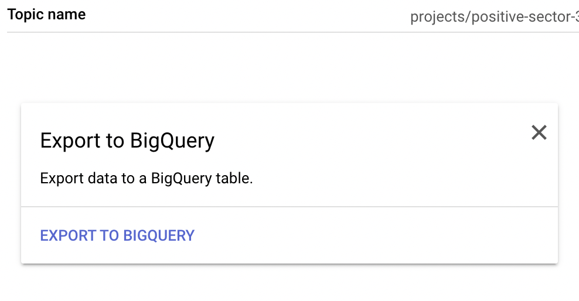
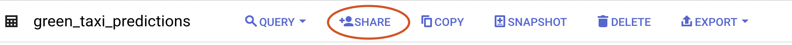
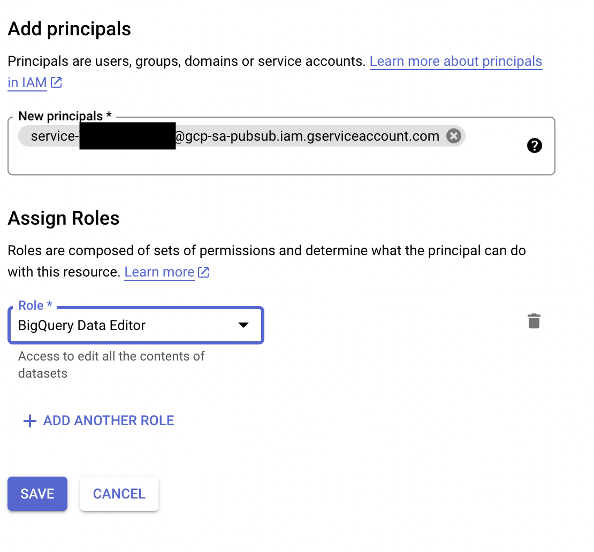
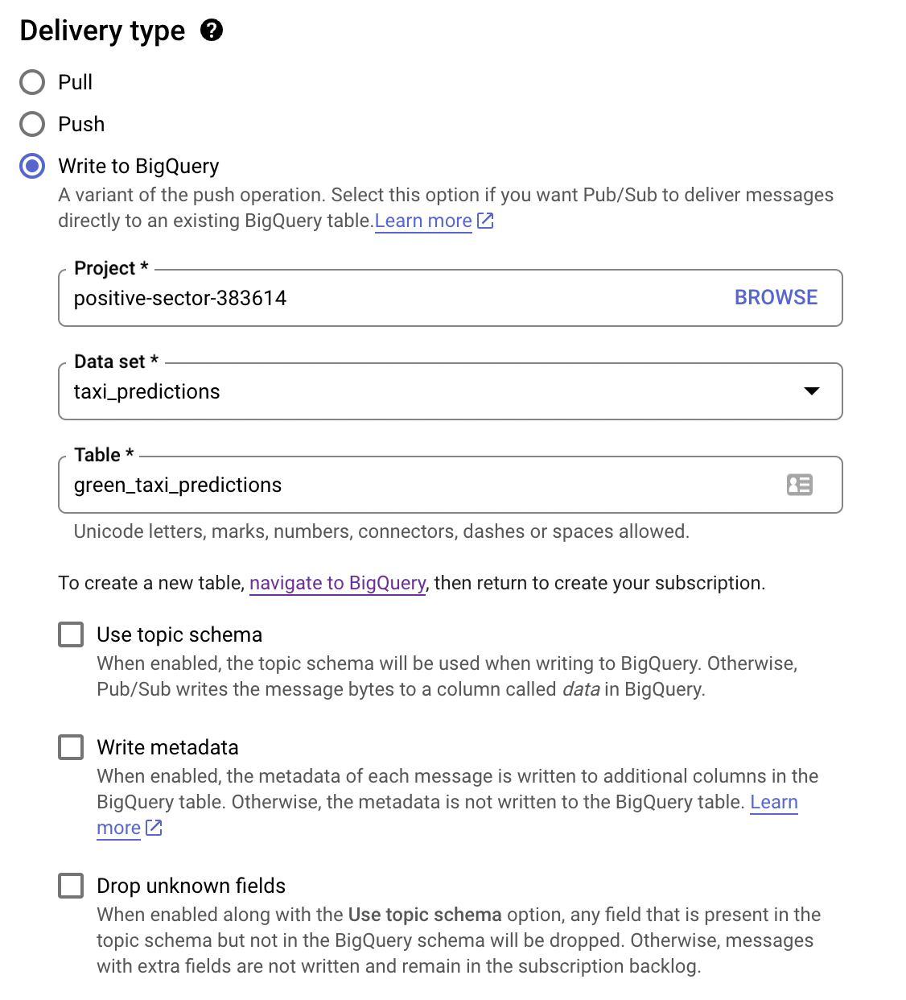
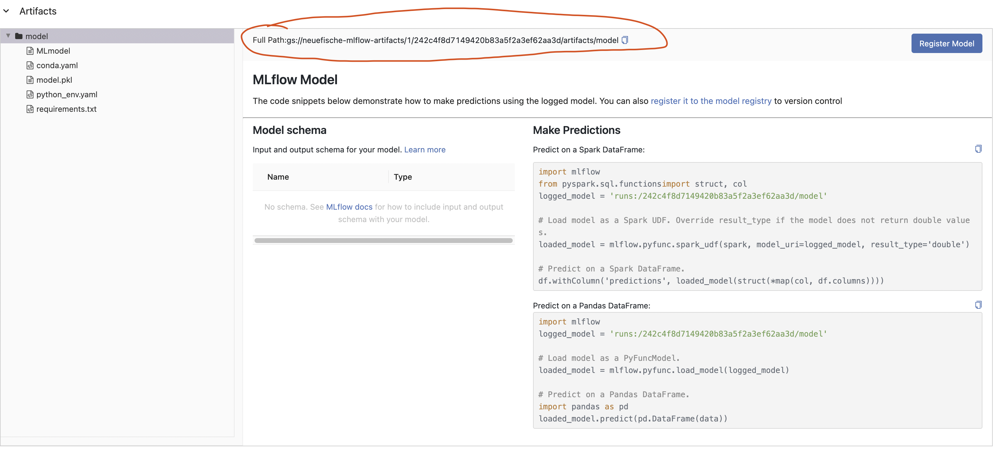

# Stream Predictions with Google Cloud Functions

We will deploy a stream prediction service with `MLFlow` and `Google Cloud Functions`. The stream prediction service will be triggered by a `Pub/Sub` message and will return the prediction to `Pub/Sub`.

### Pub/Sub

`Pub/Sub` is a fully managed real-time messaging service that allows you to send and receive messages between independent applications. You can learn more about `Pub/Sub` [here](https://cloud.google.com/pubsub/docs/overview). `Pub/Sub` combines the horizontal scalability of `Apache Kafka` and `Pulsar` with features found in traditional messaging middleware such as Apache ActiveMQ and RabbitMQ. Examples of such features are dead-letter queues and filtering.

Another feature that Pub/Sub adopts from messaging middleware is per-message parallelism, rather than partition-based messaging. `Pub/Sub` "leases" individual messages to subscriber clients, then tracks whether a given message is successfully processed.

By contrast, other horizontally scalable messaging systems use partitions for horizontal scaling. This forces subscribers to process messages in each partition in order and limits the number of concurrent clients to the number of partitions. Per-message processing maximizes the parallelism of subscriber applications, and helps ensure publisher/subscriber independence.

### Google Cloud Functions

`Google Cloud Functions` is a serverless compute product, which allows you to write functions that get triggered when an event attached to it is fired. Since it’s a serverless service, we don’t have to worry about setting up or managing servers or any infrastructure. This kind of product is also known as functions as a service (FaaS).

It’s cost effective as it only runs when the event attached to it is triggered, and terminates after the execution of the function. Furthermore, the resources scale automatically in response to the frequency of events. Therefore without having to do any further work, it can scale to handle events accordingly, from a few invocations to millions of invocations a day.

Simply put, we will deploy our model as a function, which responds to model prediction requests via HTTP endpoint.


### Setup Pub/Sub

We will use `Pub/Sub` to trigger the `Google Cloud Function` and to receive the prediction. We will use the `gcloud` command line tool to create a `Pub/Sub` topic that triggers the function. 

> make sure that you set your project as the default project
    
```bash
gcloud config set project <your-project-id>
```

**Topic**


```bash
gcloud pubsub topics create taxi_data
```

A second topic will be created to receive the predictions from the function but we will do that in the GCP Console because we can easily add BigQuery as Destination.

1. Go to the [GCP Console](https://console.cloud.google.com/)
2. Go to `Pub/Sub` and select `Topics`
3. Click on `Create Topic`
4. Name the topic `taxi_predictions`
5. Click on `Export to BigQuery` this will create a subscription to the topic and create a table in BigQuery with the same name as the topic

6. Name the subscription `taxi_predictions_bq`
7. Choose a `Data set` or create a new one 
8. Create a table name `green_taxi_predictions` in BigQuery
9. Click on `+ Share` and add the `PubSub service account` with the role `BigQuery Data Editor`  
(the service account will be created automatically and should have the following name:
service-<project-number>@gcp-sa-pubsub.iam.gserviceaccount.com
the project number can be found in the GCP Console under `IAM & Admin` -> `Settings`)


10. Edit the table and add a field name `data` with the type `JSON`.
11. Back in the `Pub/Sub` topic add the table name. 
12. Click on `Create`


### Setup Google Cloud Function

We have to first create a python file with the function that we want to deploy. Which needs to be named `main.py`. You will find the file in the `src/stream` folder. The function will be triggered by a `Pub/Sub` message and this time will not return the predictions into a file but into bigquery.

We will start with the imports:

```python
import json
import os
import base64
import mlflow

import functions_framework
from google.cloud import pubsub_v1
```

The message we get from `PubSub` is encoded and we have to decode ot with the `base64` library. We will also use the `json` library to parse the message. 

An example of a PubSub message:

```json
{
    "attributes": {
        "specversion": "1.0",
        "id": "8413039268015605",
        "source": " //pubsub.googleapis.com/projects/positive-sector-383614/topics/taxi_data",
        "type": "google.cloud.pubsub.topic.v1.messagePublished",
        "datacontenttype": "application/json",
        "time": "2023-06-17T15:18:06.509Z"
    },
    "data": {
        "message": {
            "data": "eyJyaWRlX2lkIjogIjEyMyIsICJQVUxvY2F0aW9uSUQiOiAxLCAiRE9Mb2NhdGlvbklEIjogMiwgInRyaXBfZGlzdGFuY2UiOiAzfQ==",
            "messageId": "8413039268015605",
            "message_id": "8413039268015605",
            "publishTime": "2023-06-17T15:18:06.509Z",
            "publish_time": "2023-06-17T15:18:06.509Z"
        },
        "subscription": "projects/positive-sector-383614/subscriptions/eventarc-europe-west3-pred-ride-duration-795483-sub-307"
    }
}

```

And the code to decode the message:

```python
def transfrom_input(event):
    # Extract the message body, expected to be a JSON representation of a
    # dictionary, and extract the fields from that dictionary.
    print('Recieved event:', event)
    pubsub_message = event.data["message"]
    try:
        encoded_data = pubsub_message["data"]
        decoded_data = base64.b64decode(encoded_data).decode('utf-8')
        
        ride_id = decoded_data["ride_id"]
        pick_up_location = decoded_data["PULocationID"]
        dropoff_up_location = decoded_data["DOLocationID"]
        trip_distance = decoded_data["trip_distance"]

        message_id = pubsub_message["message_id"]
        publish_time = pubsub_message["publish_time"]
        
        metadata = {
            "ride_id": ride_id,
            "message_id": message_id,
            "publish_time": publish_time,
            "PULocationID":pick_up_location,
            "DOLocationID":dropoff_up_location,
            "trip_distance":trip_distance
        }


        prediction_input = {
            'trip_route': f"{pick_up_location}_{dropoff_up_location}",
            'trip_distance': trip_distance
        }
        print('prediction_input:', prediction_input)
        return prediction_input, metadata
    except Exception as e:
        raise ValueError(f"Missing or malformed PubSub message.{event}. {e}")
```

Now we have to load the model and make the prediction. We will use the `mlflow` library to load the model. This time we will load the model directly from the `MLFlow` registry with a link to the GC Storage bucket. You can find the link in the MLFlow UI under `Artifacts` -> `Full Path`.


```python
def load_model(run_id): 
    logged_model = f'gs://neuefische-mlflow-artifacts/1/{run_id}/artifacts/model'
    # Load model as a PyFuncModel.
    loaded_model = mlflow.pyfunc.load_model(logged_model)
    return loaded_model


def apply_model(model, prediction_input):
    # Apply model to prediction input.
    prediction = model.predict(prediction_input)
    return prediction
```

Last but not least we have to call all the functions and publish the prediction to the `Pub/Sub` topic that we created earlier. We will use the `google-cloud-pubsub` library to publish the message.

```python
@functions_framework.cloud_event
def predict_duration(cloudevent):
    # Get environment variables
    RUN_ID = os.environ.get("RUN_ID")
    PROJECT_ID = os.environ.get("GCP_PROJECT")
    topic_name = os.environ["RESULT_TOPIC"]
    publisher = pubsub_v1.PublisherClient()
    
    # get data from cloudevent
    print('Loading data...')
    prediction_input, metadata = transfrom_input(cloudevent)
    # Load model
    print('Loading model...')
    model = load_model(RUN_ID)
    # make prediction
    print('Making prediction...')
    prediction = apply_model(model, prediction_input)
    # publish prediction
    message = {
        "ride_id": metadata['ride_id'],
        "message_id":metadata['message_id'],
        "publish_time": metadata['publish_time'],
        "pick_up_location": metadata["PULocationID"],
        "dropoff_up_location": metadata["DOLocationID"],
        "trip_distance": metadata["trip_distance"],
        "prediction": prediction[0]
    }
    
    print('Publishing prediction...')
    print(message)
    
    message_data = json.dumps(message).encode('utf-8')
    topic_path = publisher.topic_path(PROJECT_ID, topic_name)
    future = publisher.publish(topic_path, data=message_data)
    future.result()
    return  200, {"status": "success"}
```

Afterwards run the following command inside the `src/stream` folder to deploy the function:

```bash
gcloud functions deploy taxi_ride_duration \
--gen2 \
--runtime=python311 \
--region=europe-west3 \
--source=. \
--memory=512MB \
--entry-point=predict_duration \
--max-instances=3 \
--trigger-topic taxi_data \
--set-env-vars "RUN_ID=MLFLOW_RUNID, GCP_PROJECT=YOUR_GCP_PROJECT_ID,RESULT_TOPIC=taxi_prediction"

```

You should now see the function in the `Cloud Functions` section of the GCP Console. 

When this is done you can run the following command to test the function:

```bash
gcloud pubsub topics publish taxi_data --message '{"ride_id": "123", "PULocationID": 1, "DOLocationID": 2, "trip_distance": 3}'
```

You shoud now see new output in the logs of the function. You can find the logs in the cloud function. And of course you should see data in the `green_taxi_predictions` in BigQuery.