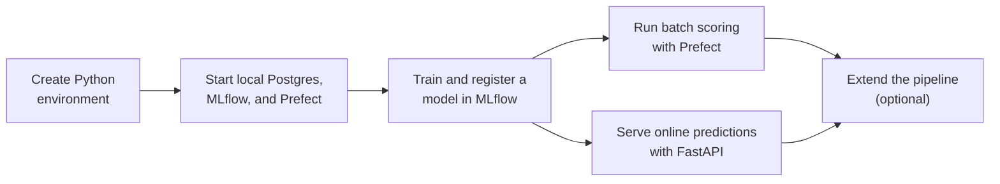

# Batch and Stream Predictions

In this repository, you will explore a local-first MLOps workflow using [MLflow](https://mlflow.org/), [Prefect](https://docs.prefect.io/), and [FastAPI](https://fastapi.tiangolo.com/).
You will train a regression model on the NYC Green Taxi dataset, register it in MLflow, orchestrate a batch prediction workflow with Prefect, and expose the same model through a lightweight online inference API.

## Learning Objectives

By the end of this repository, you should be able to:

- Explain how a local-first MLOps workflow connects model training, registration, batch scoring, and online inference.
- Prepare taxi trip features and train a baseline regression pipeline for trip-duration prediction.
- Track experiments and register reusable model versions with MLflow.
- Run a local Prefect-backed batch workflow that scores a Parquet dataset and saves the prediction output.
- Understand how scheduled Prefect runs reuse the latest registered MLflow model.
- Serve the registered model through a FastAPI prediction endpoint and compare outputs for different request scenarios.
- Extend the project by testing a stronger model and updating the active prediction target in MLflow.

## Learning Path



| File / Folder | Description |
|---|---|
| [**01 - Setup the Local Stack**](01-setup-local-stack.md) | Start the Docker-backed services and confirm that MLflow, Prefect, and Postgres are ready for the lessons. |
| [**02 - Train and Register the Model**](02-train-ml-model.ipynb) | Prepare taxi features, train a baseline regression pipeline, compare it to a simple baseline, and register the model in MLflow. |
| [**03 - Batch Predictions with Prefect**](03-batch-predictions-with-prefect.ipynb) | Run a batch scoring workflow with Prefect, inspect the prediction output, and understand how the registered MLflow model is reused for scheduled inference. |
| [**04 - Online Inference with FastAPI**](04-online-inference-with-fastapi.ipynb) | Send online prediction requests through FastAPI and compare how the API responds to different trip inputs. |
| [**05 - Local Extension Exercise (Optional)**](05-OPTIONAL-local-extension-exercise.md) | Extend the local workflow by comparing a second model or updating the active prediction target in MLflow. |

### Additional Folders and Files

| File / Folder | Description |
|---|---|
| [**data**](data/) | Output folder for the batch prediction files generated by the lessons. |
| [**infra**](infra/) | Docker Compose definition and database init script for the local stack. |
| [**src**](src/) | Project source code for training, batch scoring, online serving, and shared configuration. |
| [**tests**](tests/) | Unit tests for the feature engineering helpers. |
| [**pyproject.toml**](pyproject.toml) | Project configuration and dependencies. |
| [**uv.lock**](uv.lock) | Dependency lock file. |

## Local Data Services

This repository includes a Docker-based local stack for Postgres, MLflow, and Prefect. You will run `docker compose -f infra/compose.yaml up -d` from the project root to start the local services used throughout the lessons.

When the stack is running, the local endpoints are:

- `Postgres`: <localhost:5432>
- `MLflow`: <http://127.0.0.1:5001>
- `Prefect`: <http://127.0.0.1:4200>

## Prerequisites

- **Docker Desktop**: required to run the local Postgres, MLflow, and Prefect containers used throughout this repository. Follow the [installation instructions](https://docs.docker.com/get-docker/) if you do not have it yet. Make sure it is **installed and running** before you start the walkthrough.

> [!NOTE]
> **Windows Users:** The commands in this repository use bash syntax. Use **Git Bash** (installed with [Git for Windows](https://git-scm.com/downloads/win)) instead of PowerShell to run them.

## Setup

> [!NOTE]
> Throughout these steps, text in angle brackets like `<repo-name>` is a **placeholder**. Replace it, including the `< >` brackets, with your own value. For example, `cd <repo-name>` becomes `cd mle-batch-and-stream-predictions`.

### 1. Create the Repository from the Template

Click **Use this template** on GitHub.

When creating the repository:

- Set yourself as the **Owner**
- Choose a repository name
- Disable **Include all branches**
- Click **Create repository**

> [!IMPORTANT]
> If you are working in pairs or groups, only **one person** should complete this step.

---

### 2. Add Collaborators (Pairs/Groups Only)

If working with teammates:

1. Open the repository on GitHub
2. Go to **Settings → Collaborators**
3. Add your teammates as collaborators
4. Share the repository link with your team

Teammates should accept the invitation before continuing.

---

### 3. Clone the Repository

Copy the SSH URL from the **Code** button on GitHub, then run:

```bash
git clone <copied-ssh-url>
```

The copied SSH URL will look like `git@github.com:<your-username>/<repo-name>.git`.

---

### 4. Move into the Project Folder and Install Dependencies

This installs all dependencies and creates a virtual environment in `.venv/`.

```bash
cd <repo-name>
uv sync
```

---

### 5. Create Your Environment File

Copy the template file. Keep the default local URLs unless you intentionally change the local stack ports.

```bash
cp .env.example .env
```

The variables that matter most are:

- `MLFLOW_TRACKING_URI`: MLflow server URL used by the training, batch, and API code.
- `PREFECT_API_URL`: local Prefect API URL.
- `MLFLOW_MODEL_NAME`: registered model name that batch and online inference resolve by default.
- `BATCH_INPUT_URI`: Parquet file scored in the batch chapter.

> [!CAUTION]
> `.env` holds your local configuration and any credentials you add later. Never commit it. Only `.env.example`, with placeholder values, belongs in the repository.

---

### 6. Open the Notebooks

> [!NOTE]
> Make sure you open VS Code from the project root so it automatically detects the environment created by `uv sync`.

Launch VS Code in the project root folder:

```bash
code .
```

Then open a notebook and select the Python environment created by `uv sync` as the kernel. Every command in the lessons runs through `uv run`, so this environment is used automatically.

## Cleanup

When you are done for the day, stop the local services but keep the Postgres volume and generated files:

```bash
docker compose -f infra/compose.yaml down
```

To fully reset the repo to a clean local state, remove the Docker volumes and the generated lesson outputs:

```bash
docker compose -f infra/compose.yaml down -v
rm -rf data/predictions storage/mlartifacts .env
mkdir -p data
touch data/.gitkeep
```

These commands remove the local MLflow runs, registered model metadata, batch prediction Parquet files, and your copied `.env`. Before restarting the lessons, redo Setup step 5 to recreate `.env`, then follow [01 - Setup the Local Stack](01-setup-local-stack.md) to restart the services.

## References & Further Reading

- [**MLflow Docs**](https://mlflow.org/docs/latest/ml/): Official MLflow documentation for classical ML.
- [**MLflow Model Registry**](https://mlflow.org/docs/latest/model-registry.html): How model versions, aliases, and stages work.
- [**MLOps Principles**](https://ml-ops.org/content/mlops-principles): The MLOps principles this repository puts into practice.
