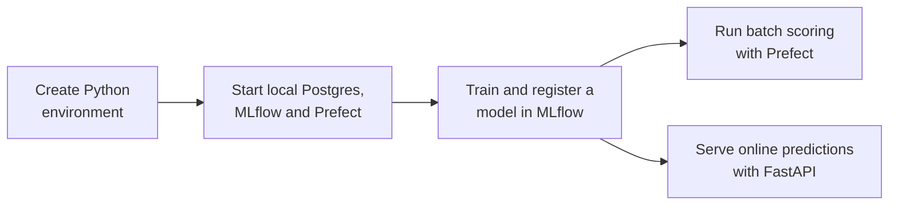

# Batch and Stream Predictions

In this repository, you will explore a local-first MLOps workflow using [MLflow](https://mlflow.org/), [Prefect](https://docs.prefect.io/), and [FastAPI](https://fastapi.tiangolo.com/).
You will train a regression model on the NYC Green Taxi dataset, register it in MLflow, orchestrate a batch prediction workflow with Prefect, and expose the same model through a lightweight online inference API.

## Learning Path

- [01 - Setup the local stack](01-setup-local-stack.md): Set up the local Docker-backed services, create the Python environment, and confirm that MLflow, Prefect, and Postgres are ready for the lessons.
- [02 - Train and register the model](02-train-ml-model.ipynb): Prepare taxi features, train a baseline regression pipeline, compare it to a simple baseline, and register the model in MLflow.
- [03 - Batch predictions with Prefect](03-batch-deployment.ipynb): Run a batch scoring workflow with Prefect, inspect the prediction output, and understand how the registered MLflow model is reused for scheduled inference.
- [04 - Online inference with FastAPI](04-online-inference-with-fastapi.ipynb): Send online prediction requests through FastAPI and compare how the API responds to different trip inputs.
- [05 - Local extension exercise (optional)](05-OPTIONAL-local-extension-exercise.md): Extend the local workflow by comparing a second model or updating the active prediction target in MLflow.

## Local Data Services

This repository includes a Docker-based local stack for `Postgres`, `MLflow`, and `Prefect`. You will run `docker compose -f infra/compose.yaml up -d` from the project root to start the local services used throughout the lessons.

When the stack is running, the local endpoints are:

- `Postgres`: `localhost:5432`
- `MLflow`: `http://127.0.0.1:5001`
- `Prefect`: `http://127.0.0.1:4200`

## Mermaid Diagrams

This repository contains Mermaid diagrams. If you want them to render in VS Code, we recommend installing the `Markdown Preview Mermaid Support` extension:

- [Install in VS Code](vscode:extension/bierner.markdown-mermaid)
- [View on Marketplace](https://marketplace.visualstudio.com/items?itemName=bierner.markdown-mermaid)

## Setup

- Please make sure you **use this repository as a template**.

- There will be no virtual environment created at this stage.

- You will need **Docker Desktop** installed and running on your machine. If you do not have it installed, please follow the [installation instructions](https://docs.docker.com/get-docker/).

## Repository Workflow



This is the sequence you will use when you first walk through the repository, after creating the virtual environment and installing the dependencies:

### 1. Check the Python environment

```bash
python --version
python -c "import fastapi, mlflow, prefect; print('Core imports look good.')"
```

### 2. Start the local services

**`macOS`** / **`Linux`** / **`Git Bash`**

```bash
mkdir -p storage/mlartifacts data/predictions
docker compose -f infra/compose.yaml up -d
```

**`PowerShell`**

```powershell
New-Item -ItemType Directory -Path storage/mlartifacts, data/predictions -Force
docker compose -f infra/compose.yaml up -d
```

If you want to watch the startup in real time:

```bash
docker compose -f infra/compose.yaml logs -f postgres mlflow prefect
```

### 3. Confirm the services are reachable

```bash
docker compose -f infra/compose.yaml ps
curl http://127.0.0.1:5001
curl http://127.0.0.1:4200/api/health
```

### 4. Run the training and batch steps

```bash
python -m src.training.train
python -m src.batch.flow
```

### 5. Start and test the API

```bash
python -m uvicorn src.serve.api:app --reload
```

```bash
curl -X POST http://127.0.0.1:8000/predict \
  -H "Content-Type: application/json" \
  -d '{"PULocationID": 1, "DOLocationID": 2, "trip_distance": 3.5}'
```

## Cleanup

When you are done for the day, stop the local services but keep the Postgres volume and generated files:

```bash
docker compose -f infra/compose.yaml down
```

To fully reset the repo to a clean local state, remove Docker volumes and generated lesson outputs:

**`macOS`** / **`Linux`** / **`Git Bash`**

```bash
docker compose -f infra/compose.yaml down -v
rm -rf data/predictions storage/mlartifacts .env
mkdir -p data
touch data/.gitkeep
```

**`PowerShell`**

```powershell
docker compose -f infra/compose.yaml down -v
Remove-Item data/predictions, storage/mlartifacts, .env -Recurse -Force -ErrorAction SilentlyContinue
New-Item -ItemType Directory -Path data -Force
New-Item -ItemType File -Path data/.gitkeep -Force
```

The reset command removes local MLflow runs, registered model metadata, batch prediction Parquet files, and your copied `.env`. Run the setup steps again before restarting the lessons.

## Learning Objectives

By the end of this repository, you should be able to:

- Explain how a local-first MLOps workflow connects model training, registration, batch scoring, and online inference.
- Prepare taxi trip features and train a baseline regression pipeline for trip-duration prediction.
- Track experiments and register reusable model versions with MLflow.
- Run a local Prefect-backed batch workflow that scores a Parquet dataset and saves the prediction output.
- Understand how scheduled Prefect runs reuse the latest registered MLflow model.
- Serve the registered model through a FastAPI prediction endpoint and compare outputs for different request scenarios.
- Extend the project by testing a stronger model and updating the active prediction target in MLflow.
